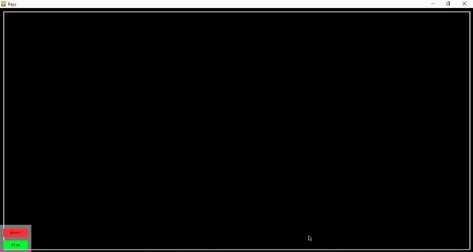
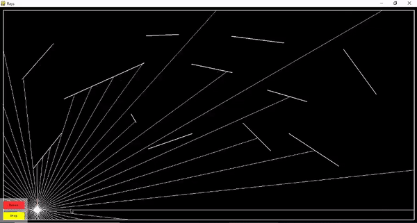
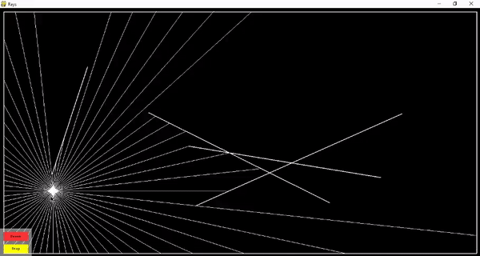
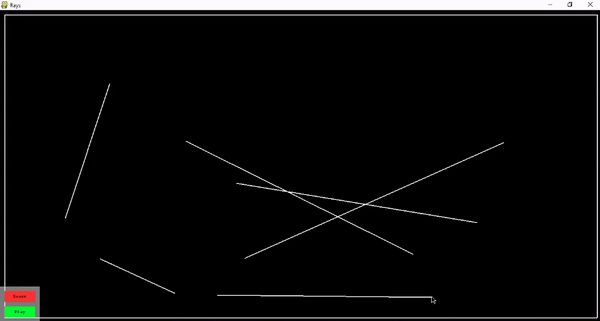

# Ray-tracing in pygame
This is my implementation of ray tracing in pygame

## Requirements
- `python 3.5+`
- pygame `pip install pygame`

## Usage
- Run `python3 main.py` in script directory

## Showcase

#### Building walls
To build a wall you have to press left mouse button to set starting position for a wall, select ending point and press left mouse button again. To cancel drawing a wall press right mouse button. **You can't draw walls while playing**

#### Playing
Press Play button in down-left corner and move your mouse around to change a location of the source of light.

You can stop the game and add more walls if you want.

#### Reset
If you want to reset the map just press Reset Button

## You can modify these variable inside `main.py`
- `number_of_rays` - Number or rays that you want to simulate, default is 60. **Max 360**
- `wall_thicknes` - Thickness of wall, default is 2 (in pixels).
- `boundarySpacing` - Number of pixels that boundary will be from the edge of the screen, default 10. 

## Future plans
- Adding adjustable strenght of light